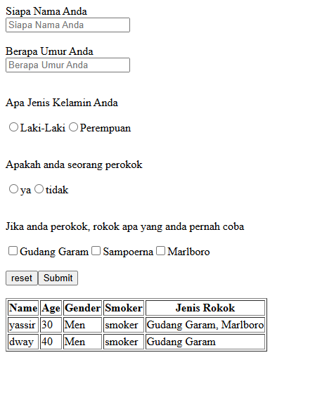

# Form Survey

This project is a simple form survey built with React and Vite, utilizing React's useState to manage form data and dynamically render a table of responses.

## Preview



## How To Run This Project

Clone this project url :

``` https://github.com/VsalCode/fgo24-react-table.git ```

after entering the folder, install the dependencies:

```npm install```

To run the web you can use the command :

```npm run dev```

##  dependencies used
- Vite


## How To Contribute

Pull requests are welcome. For major changes, please open an issue first
to discuss what you would like to change.

Please make sure to update tests as appropriate.

## License

[ISC](https://opensource.org/license/isc-license-txt)
